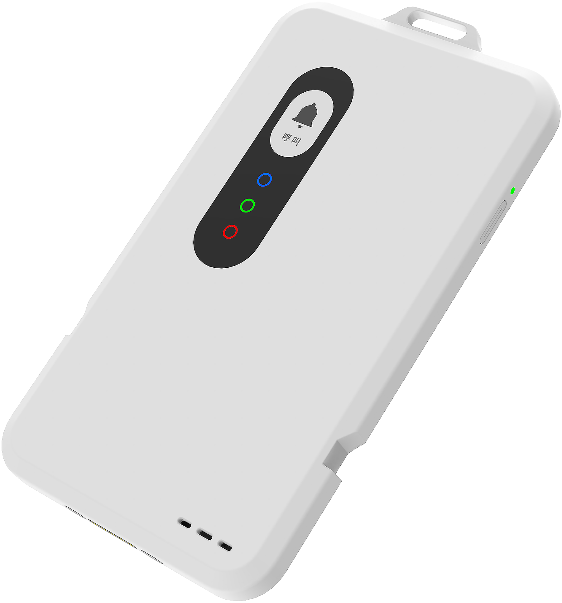
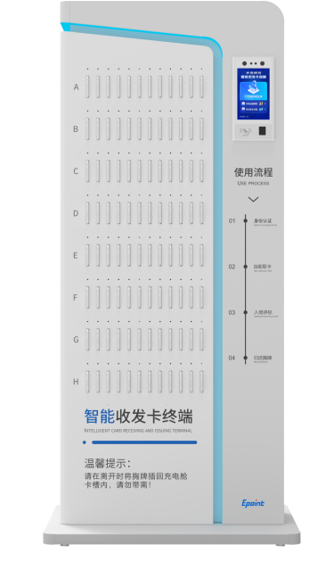
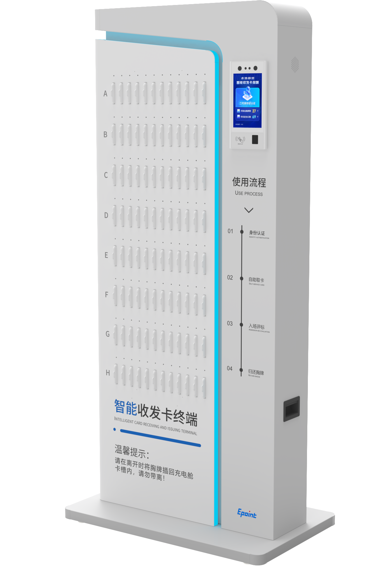

- [新点智能胸牌产品介绍](#新点智能胸牌产品介绍)
  - [一. 产品概述](#一-产品概述)
  - [二. 产品架构](#二-产品架构)
  - [三. 产品能力](#三-产品能力)
  - [四. 产品优势](#四-产品优势)
    - [4.1 给客户带来了什么价值?](#41-给客户带来了什么价值)
    - [4.2 相比与友商(竞品)有什么优势?](#42-相比与友商竞品有什么优势)

---

# 新点智能胸牌产品介绍

- [新点智能胸牌产品介绍PDF下载](files/智能胸牌/新点智能胸牌产品介绍(Epoint-ESRB1.0)V1.3.pdf)

-<video src="videos/智能胸牌/智能胸牌系统整体介绍.mp4" controls width="600" height="400"></video>

## 一. 产品概述

&emsp;&emsp;新点智能胸牌（Expert Smart Recording Badge，以下简称“智能胸牌”）是一款集成了录音、轨迹定位、佩戴检测以及一键呼叫的智能化产品。用于评标区内对专家言行进行多维度管理，依据智能胸牌提供的实时录音以及专家行为轨迹，结合配套服务平台，实现评标区内人员在评标过程中全方位监管，保障评标活动的公平公正。

&emsp;&emsp;智能胸牌为交易中心客户提供场地数字化、流程标准化、监管无人化的场地服务标准化能力，帮助中心更高效、多维度地的对评标区内人员的活动进行合理有效的监督，助力公共资源交易中心数字化、智能化转型。

## 二. 产品架构

智能胸牌ESRB的产品架构由智能胸牌及配套的硬件支撑设备、应用服务平台组成。

- **硬件产品：** 智能胸牌、智能收发卡终端、人员轨迹配套硬件及无线网络系统

- **应用服务平台：** 评标区不见面评标管控系统，也可以作为总控或数字见证系统的一个功能模块

&emsp;&emsp;`智能胸牌` 提供的录音、人员轨迹数据以及佩戴检测、预警提醒、一键呼叫能力；“智能收发卡终端”配合门禁闸机实现智能胸牌的自助收发，并支持舱内充电；“人员轨迹配套硬件”包括定位基站、定位引擎等，为评标区内人员轨迹提供数据接收以及通信能力。“无线网络系统”包括吸顶AP、无线控制器AC以及网络交换机，为智能胸牌在评标区实时数据传输提供基础网络环境。

&emsp;&emsp;`应用服务平台` 包括智能胸牌管理、入区管理、呼叫处理、行为查看以及评标区预警五大核心模块。“智能胸牌管理”模块为中心场地管理人员提供标准的设备信息维护以及设备信息查询功能；“入区管理”模块对智能胸牌的收发卡进行统一管理，围绕自助收发卡、手动发卡、人员入区记录以及收发卡记录提供标准化管理服务。“呼叫处理”模块为场地管理人员提供呼叫处理入口，工作人员通过呼叫处理模块对智能胸牌发出的“一键呼叫“进行响应，可实时展示发起人员当前定位并联动展示周围环境监控与录音。“行为查看“模块依据高精度人员定位系统，结合场地内监控与胸牌录音，为中心人员提供多维度的场地监管能力。“评标区预警”模块基于场地内人员的行为数据进行动态检测，为中心提供包括但不限于越界、非法闯入、违规接触、离岗、未佩戴胸牌等行为预警检测能力，并支持通过“智能胸牌”设备向违规人员推送实时提醒。

## 三. 产品能力

- **高精度定位：** 基于UWB（Ultra-Wideband）无线通信技术，实现高精度（误差不超过30厘米）定位，具有实时性、低延迟、多目标以及抗干扰等优点。
- **佩戴检测：** 智能胸牌ESRB内置六轴陀螺仪对佩戴者运动姿态进行动态分析、实时演算，对未正确佩戴人员进行实时提醒，确保数据真实有效。
- **实时录音：** 智能胸牌ESRB内置高灵敏全向麦克风，对佩戴者周围音频进行采集，支持音频流与音频文件两种格式传输。
- **预警检测：** 基于强大的算法引擎，通过对佩戴者轨迹数据进行动态分析，精准识别违规行为，实时向应用服务平台进行预警推送。
- **预警推送：** 智能胸牌ESRB内置扬声器和振动马达，支持通过应用服务平台API接口向“智能胸牌”进行预警提醒信息推送。
- **一键呼叫：** 智能胸牌ESRB内置一键呼叫按钮，为评标区人员提供紧急求助途径。
- **状态监测：** 智能胸牌ESRB支持设备状态实时更新，通过心跳包机制向服务器同步，动态检测设备状态，将异常预警实时向应用服务平台推送。
- **持久续航：** 内置大容量聚合锂电池，支持最低10小时的运行续航，满足一天连续评标。
- **大容量存储：** 智能胸牌ESRB内置16GB存储，支持最长48小时录音文件离线存储（录音文件上传成功后自动删除）。
- **NFC读写：** 智能胸牌ESRB采用近距离无线通信技术，内置NFC线圈，可作为IC卡进行读写操作。
- **OTA升级：** 支持OTA在线固件升级，日志上传。
- **离线部署：** 智能胸牌ESRB支持离线部署，通过“智能收发卡终端”进行录音文件上传以及固件更新。

## 四. 产品优势

### 4.1 给客户带来了什么价值?

- 符合场地管理以及见证相关的政策要求；
- 胸牌拥有自动预警功能，当专家进行了违规行为（如发生未佩戴胸牌或违规接触时），胸牌能够自动通过语音和振动进行提醒，及时中止专家的违规行为，为中心规避了违规事件的风险；
- 相比人工手动发卡，智能胸牌可以通过终端进行专家自助收发。中心不需要安排专职人员进行人工发放，并且智能支持在终端内充电，减少场地工作人员的日常维护工作量；
- 智能胸牌可以与监控视频进行联动展示专家的轨迹轨迹信息、录音以及周围的环境监控，让中心的见证监督人员知道专家“去了哪里？”、“干了什么？”以及“说了什么”，提高中心对专家的行为监管能力；
- 胸牌配备了陀螺仪，实时检测专家是否佩戴了胸牌，保证胸牌采集的数据有效；

### 4.2 相比与友商(竞品)有什么优势?

- 友商主流的室内定位方案是通过监控摄像头捕捉人脸绘制人员轨迹，相比监控视频定位方案，UWB室内定位精度更高（能够实时的知道专家的具体位置，而摄像头的方案只能知晓专家在哪个摄像头中出现）、稳定性更好且不易受到干扰；
- 友商的定位方案存在监管盲区，例如走廊尽头、拐角以及洗手间等区域，而智能胸牌能够实现评标区的全覆盖监管；
- 通过摄像头捕获人脸的视觉方案，存在专家因为低头、侧脸等方式导致未定位到该人员的情况，最终定位的数据不准、预警信息不对等情况；
- 摄像头的方案对于声音的获取存在一定难度，大部分是通过监控摄像头搭配拾音器来实现，但是对于一些嘈杂或者声音比较低的情况下，无法清晰将专家说的话录制下来，且无法区别是哪个专家说的。
